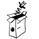

Aktivität durchführen
---------------------

### Kurz vor der Aktivität

*   Frühzeitiges Treffen des Leitungsteams
*   Alle haben das Detailprogramm dabei
*   Besprechung des Ablaufs und Abmachen, wer welche Teile leitet

Gegebenenfalls muss das Programm der aktuellen Situation angepasst werden:

*   Anzahl Kinder, Wetter, Material
*   Überprüfung der geplanten Sicherheitsüberlegungen und falls nötig Anpassung derselben (3x3)
*   Bereitstellung und Prüfung des Materials

*   Begrüssung der Teilnehmenden und Eltern

### Während der Aktivität

*   Packende Begrüssung (Einstiegsritual)
*   Sorgfältige Umsetzung der Sicherheitsüberlegungen und Anpassung derselben, falls nötig (3x3)
*   Bekanntgabe von (Spiel-)Regeln und evtl. Zielen
*   Verständliche Erklärung von Programm und Spielen
*   Aktiver Einbezug aller (auch herausfordernder) Teilnehmenden ins Programm
*   Motiviertes Leitungsteam = motivierte Teilnehmende!
*   Gegenseitige Unterstützung im Leitungsteam
*   Klarer Abschluss (Abschiedsritual)

### Weitere Informationen
| | |
|---|---|
| [][1] | [Broschüre «Programm»][1] |

[1]: https://www.scout.ch/de/verband/downloads/programm/lager/j-s/j-s-leitfaden-lagersport-trekking-grundlagen/view